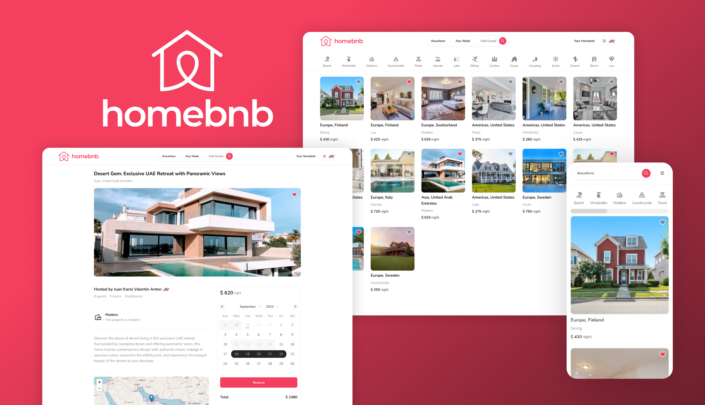

# Homebnb
> A modern [Next.js](https://nextjs.org/) web application for a full-stack Airbnb clone, built with React, TypeScript, and Tailwind CSS.


---

## 📸 Preview



---

## ✨ Features

- **User Authentication:** Secure credential, Google, and Github authentication.
- **Property Listings:** Users can create, view, and delete property listings.
- **Advanced Search:** Search for properties by category, date range, location, and number of guests.
- **Booking System:** Users can book properties and view their reservations.
- **Favorites:** Users can add and remove properties from their favorites.
- **Image Uploads:** Upload property images to Cloudinary.
- **Responsive Design:** Fully accessible on desktop and mobile devices.

---

## 🚀 Live Demo

Check out the live version here:
**[🔗 Live Project](https://airbnb-clone-jkv21s-projects.vercel.app/)**

---

## 🛠️ Tech Stack

- **Framework:** [Next.js](https://nextjs.org/) `13.2.4`
- **UI Library:** [React](https://react.dev/) `18.2.0`
- **Language:** [TypeScript](https://www.typescriptlang.org/) `5.0.2`
- **Styling:** [Tailwind CSS](https://tailwindcss.com/) `3.2.7`
- **ORM:** [Prisma](https://www.prisma.io/) `4.11.0`
- **Database:** [MongoDB](https://www.mongodb.com/)
- **Authentication:** [NextAuth.js](https://next-auth.js.org/) `4.20.1`
- **Deployment:** [Vercel](https://vercel.com/)

---

## 📁 Project Structure

```bash
├─ app/                # Next.js App Router pages & API routes
│  ├─ (root)/          # Root layout and pages
│  ├─ api/             # API routes
│  ├─ components/      # Reusable UI components
│  ├─ hooks/           # Custom React hooks
│  ├─ libs/            # Utility functions / helpers
│  └─ ...
├─ pages/              # Next.js pages directory
│  └─ api/             # API routes for authentication
├─ prisma/             # Prisma schema
├─ public/             # Static assets (images, icons, etc.)
└─ ...
```

---

## ⚙️ Getting Started

### ✅ Prerequisites

* Node.js (v14.x or later)
* npm / yarn / pnpm

### 🧰 Installation

1. Clone the repository:

   ```bash
   git clone https://github.com/jkvdev/airbnb.git
   ```
2. Navigate to the project directory:

   ```bash
   cd airbnb
   ```
3. Install the dependencies:

   ```bash
   npm install
   ```

### 🔐 Environment Variables

This project requires environment variables. Create a `.env` file in the root and add:

```env
DATABASE_URL=
GOOGLE_CLIENT_ID=
GOOGLE_CLIENT_SECRET=
GITHUB_ID=
GITHUB_SECRET=
NEXTAUTH_SECRET=
NEXT_PUBLIC_CLOUDINARY_CLOUD_NAME=
```

### ▶️ Running the Development Server

```bash
npm run dev
```

Visit [http://localhost:3000](http://localhost:3000) to view it in your browser.

---

## 💡 Key Learnings & Challenges

* Used **server-side rendering (SSR)** for optimal performance.
* Implemented the new **Next.js 13 App Router**.
* Integrated a **Prisma ORM** to manage the MongoDB database.
* Secured the application with **NextAuth.js** for user authentication.
* Focused on accessibility and responsive design across devices.

---

## 🗺️ Roadmap

* [ ] Implement user reviews and ratings
* [ ] Add a messaging system between users
* [ ] Improve search filters and sorting options
* [ ] Add admin dashboard for managing users and listings
* [ ] Implement unit and integration tests

---

## 📝 License

This project is licensed under the MIT License. See the [LICENSE](LICENSE) file for details.

---

## 📬 Contact

**Valentin Costea** – [Portfolio](https://jkvdev.com) – [jkv21contact@gmail.com](mailto:jkv21contact@gmail.com)